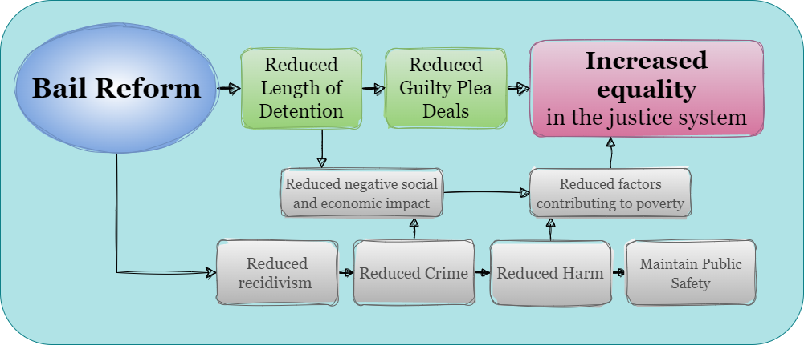
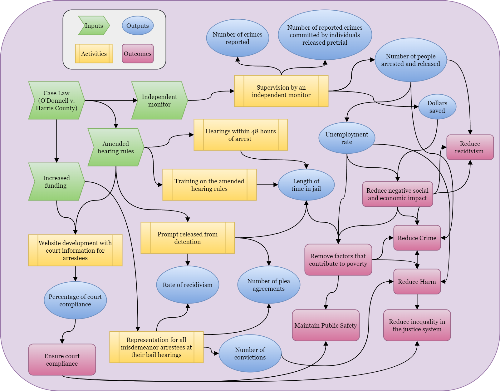
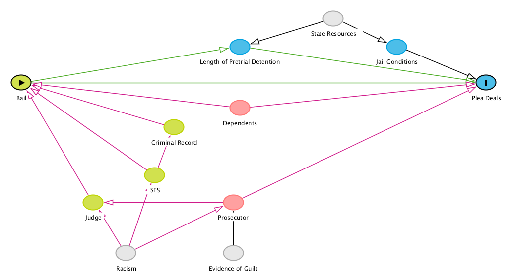

---

\newpage

```{r setup, include=FALSE}
# Change this to `echo = FALSE` to hide all code
knitr::opts_chunk$set(echo = TRUE)

library(tidyverse)
library(broom)
library(modelsummary)
library(kableExtra)

```

# Introduction

*Describe the motivation for this evaluation, briefly describe the program to be evaluated, and explain why it matters for society. (**≈150 words**)*

\newpage

# Program overview

*Provide in-depth background about the program. Include details about (1) when it was started, (2) why it was started, (3) what it was designed to address in society. If the program hasn't started yet, explain why it's under consideration. (**≈300 words**)*

In May 2016, a young woman filed a class action suit in the U.S. District Court for the Southern District of Texas against Harris County, Texas, and the Harris County Sheriff's Department claiming that the county’s bail system violated the Equal Protection and Due Process Clauses of the Constitution. Bail amounts were set according to a predetermined schedule that did not take individual circumstances into consideration. 

After more than three years in the courts, in November 2019, Judge Rosenthal approved the consent decree which required Harris County to make major reforms to its bail program. Reforms included amended hearing rules and a requirement for clear and convincing evidence that an individual can pay the bail amount required for release. The decree also provided more funding for representation for all misdemeanor bail hearings and a website for arrestees to access important case information to support compliance [@DONNELLHARRISCOUNTY2019].

Money bail systems have long been utilized by the criminal justice system to detain individuals arrested for a crime while they await trial. In a study published in the Stanford Law Review, researchers found that pretrial detention leads to individuals pleading guilty simply to be released, receiving longer jail sentences, and increases the likelihood of the individual committing future crimes [@heatonDownstreamConsequencesMisdemeanor2016]. 

Bail reform, including the elimination of money bail for most misdemeanor offenses, reduces socioeconomic inequality in the justice system, increases compliance with future court dates, and does not contribute to increases in crime in the area [@widraHowDoesUnaffordable2018]. This policy certainly decreases the length of time individuals are detained, and the negative impacts of detention have been well documented. Aside from less quantifiable consequences such as job and income loss while detained, time away from children and family, and the impact and trauma of those relying on the individual for financial and emotional support, there is plenty of empirical support linking pretrial detention to higher rates of conviction [@digardJusticeDeniedHarmful2019]. Reducing the amount of time individuals spend in jail before they are ever convicted of a crime is essential to increasing equality, reducing factors that contribute to criminal activity, and overall reducing harm to a community.
\newpage

# Program theory and implementation

## Program theory and impact theory graph

*Explain and explore the program's underlying theory. Sometimes programs will explain why they exist in a mission statement, but often they don't and you have to infer the theory from what the program looks like when implemented. What did the program designers plan on occurring? Was this theory based on existing research? If so, cite it. (**≈300 words**)*

*Include a simple impact theory graph showing the program's basic activities and outcomes. Recall from class and your reading that this is focused primarily on the theory and mechanisms, not on the implementation of the program.*

The Fourteenth Amendment of the US Constitution protects liberty and equality stating, “No State shall make or enforce any law which shall abridge the privileges or immunities of citizens of the United States; nor shall any State deprive any person of life, liberty, or property, without due process of law; nor deny to any person within its jurisdiction the equal protection of the laws.” Cash bail systems violate this right by imprisoning individuals who have not been convicted of a crime simply for their inability to pay bail. 

If the ultimate goal is to increase equality in the justice system while maintaining public safety, cash bail is impeding that goal. Detaining individuals because they are poor has a negative social and economic impact because it removes people from their families and their jobs. By reducing negative social and economic impacts, factors that contribute to poverty can be lessened or eliminated. A wealth of research exists to support the theory that poverty and inequality are positively correlated with increased crime [@fajnzylberInequalityViolentCrime2002;@freemanEconomicsCrime1999; @fleisherEffectIncomeDelinquency1966; @mohammedDoesPovertyLead2018]. Thus, it follows that removing cash bail for misdemeanors would lead to more equality, which may lead to reduced crime and reduced harm while maintaining public safety.

Detaining individuals without due process is not only unconstitutional and potentially a human rights violation, it also has negative impacts on the community. According to a 2018 study, more than half of inmates in local jails were parents to children under 18, and that percentage was even higher for women [@sawyerWhatDoesSuccessful2022]. In a survey conducted by George Mason University in 2016, 40.5% of detained parents reported that being in jail has or would change the living situation for their children [@kimbrellMoneyBondProcess2016]. The impact on children when the parent they rely on for emotional and financial support is separated from them can be traumatic, significant, and permanent. The same survey also revealed that of the participants, 69.9% were employed before being detained, and of those 84.3% worried they would lose employment due to detention [@kimbrellMoneyBondProcess2016].

Based on the theory that cash bail systems discriminate based on financial status and detention has a negative impact on communities, reforming the bail system is an optimal solution to reduce inequality, crime, and harm in general.




\newpage

## Logic model

*Describe the program's inputs, activities, outputs, and outcomes. Pay careful attention to how they are linked—remember that every input needs to flow into an activity and every output must flow out of an activity. (**≈150 words**)*

*Use flowchart software to connect the inputs, activities, outputs, and outcomes and create a complete logic model. Include this as a figure.*

### Inputs

- Case Law (O'Donnell v. Harris County)
- Amended hearing rules
- Increased funding 
- Independent monitor

### Activities

- Website development with court information for arrestees
- Training on the amended hearing rules
- Representation for all misdemeanor arrestees at their bail hearings
- Supervision by an independent monitor
- Hearings within 48 hours of arrest 	
- Prompt released from detention

### Outputs

- Number of plea agreements
- Percentage of court compliance
- Rate of recidivism
- Number of people arrested and released
- Number of crimes reported
- Number of reported crimes committed by individuals released pretrial
- Unemployment rate
- Length of time in jail
- Dollars saved
- Number of convictions


### Outcomes

- Removed and reduced factors that contribute to poverty
- Reduced crime
- Reduced harm
- Reduced economic impact
- Increased equality in the justice system
- Maintain public safety


### Diagram

 

\newpage

# Outcome and causation

## Main outcome

Select one of the program's outcomes to evaluate. Explain why you've chosen this (is it the most important? easiest to measure? has the greatest impact on society?) (**≈50 words**)

## Measurement

*Using the concept of the "ladder of abstraction" that we discussed in class (e.g. identifying a witch, measuring poverty, etc.), make a list of all the possible attributes of the outcome. Narrow this list down to 3-4 key attributes. Discuss how you decided to narrow the concepts and justify why you think these attributes capture the outcome. Then, for each of these attributes, answer these questions:*

*- *Measurable definition*: How would you specifically define this attribute? (i.e. if the attribute is "reduced crime", define it as "The percent change in crime in a specific neighborhood during a certain time frame" or something similar)*
*- *Ideal measurement*: How would you measure this attribute in an ideal world?*
*- *Feasible measurement*: How would you measure this given reality and given limitations in budget, time, etc.?*
*- *Measurement of program effect*: How would to connect this measure to people in the program? How would you check to see if the program itself had an effect?*

(**≈150 words** in this section)

### Possible outcomes

- Equality in the justice system
- Reduced crime
- Reduced harm
- Reduced negative social and economic impact
- Court compliance
- Remove factors that contribute to poverty

### Outcome 1: Equality in the justice system

#### Attributes:

- Economic and racial disparities in arrests, convictions, and sentencing
- Impact of detention on economic prospects
- Conviction rates of detained and released defendants
- Conviction rates for defendants with a private attorney versus a public defender
- Rate of defendants accepting plea deals
  - Consider the length of detention and release status at the time of the deal
  - Economic and racial disparities by type of crime
- Length of detention pretrial
  - Economic and racial disparities in detention length by type of crime

To measure equality in the justice system, economic and racial disparities must be considered. The most obvious place to start is with the rate of arrests, convictions, and sentencing across individuals with different economic and racial backgrounds because this could illuminate clear patterns of discrimination inherent in the system, and whether bail reform has a positive impact on the numbers. The conviction rates for detained and released defendants are also measurable, and it is a good indicator of the degree of the advantage of not being detained while appearing in court. Individuals are to be presumed innocent until proven guilty but appearing in court in a jumpsuit and shackles can give the impression of guilt even for innocent defendants. Many individuals have stated that they chose to agree to a plea deal because they could not afford bail and the alternative was to wait in jail for a court appearance. If bail was not an obstacle, the rate of individuals accepting plea deals should decrease because innocent people would not normally agree to a guilty plea without the coercion of detention.

##### Attribute 1: - Economic and racial disparities in arrests, convictions, and sentencing

- **Measurable definition**: The rate of arrests, convictions, and sentences compared across different individuals with different economic and racial backgrounds.
- **Ideal measurement**: Collect information about the age, employment status, income, housing situation, and race of all individuals charged with a crime to compare associations with higher rates of conviction or higher sentencing.
- **Feasible measurement**: Information about the racial identity and age of an individual is usually collected with the arrest record. The economic identifiers are more difficult to gather, but they could be collected as part of a voluntary survey upon release or at the courthouse. The length of time spent in detention should be public record as well.
- **Measurement of program effect**: The program effect could be measured by linking fewer days in detention to lower conviction rates. Additionally, if the disparity of economic and racial backgrounds is less severe after cash bail is ended, that could indicate that the bail program was targeting low-income people of color.

##### Attribute 2: Conviction rates of detained and released defendants

- **Measurable definition**: Appearing before the court as a non-detained defendant impacts the rate of conviction.
- **Ideal measurement**: Collect information regarding the detention status of defendants in court and how it correlates with conviction rates.
- **Feasible measurement**: In this case, the ideal measurement is available from the court records.
- **Measurement of program effect**: Bail reform allows most people arrested for a misdemeanor to be released from detention and return to the court for their next court date. If the rate of conviction is lower for non-detained defendants, this provides evidence that individuals are given more equitable proceedings when they are not brought to court directly from the jail.

##### Attribute 3: Rate of defendants accepting plea deals

- **Measurable definition**: Rate of individuals agreeing to plea deals after arrest.
- **Ideal measurement**: Collecting information from every arrestee about their reason for accepting or rejecting a plea deal.
- **Feasible measurement**: By comparing the type of crime the individual is charged with, their criminal history, and the amount of time they were detained pretrial, there may be an indication that pretrial detention increases the likelihood of accepting a plea deal, especially when the pretrial time period longer.
- **Measurement of program effect**: If individuals are less likely to accept a plea deal after release from detention, it may conclude that release from detention was a primary reason for considering a plea deal.


### Outcome 2: Remove factors that contribute to poverty

#### Attributes:

- Social and economic impact of detention
  - Job loss
  - Loss of housing
  - Childcare implications
  - Financial and emotional stress on non-detained family members
- Unemployment rate
- Family separation
- Job readiness
- Education outcomes for the children of detained adults
- Permanent criminal record (in the case of individuals taking plea deals to be released more quickly)

While there are many factors that contribute to poverty, the financial and emotional stress on non-detained family members, family separation, and job loss are measurable attributes to assess the impact of pretrial detention. Financial and emotional stress on non-detained family members is a key contributor to poverty; many children rely on one parent working multiple jobs to make ends meet, and emotional support is often lacking in low-income families. Removing the only source of income and support from children can have lasting traumatic impacts, both financially and emotionally. Family separation has a similar impact, but here the focus is on the outcomes of children in the care of detained adults. Detention can lead to worse educational outcomes, risk-taking behavior, and mental health issues for children when they are separated from their parents. Employment has a direct link to income; for most people, without employment, there is no income, and lack income is a direct contribution to poverty. If individuals have jobs when they are arrested, but lose them due to extended detention, they are in a worse position when they are released.

##### Attribute 1: Financial and emotional stress on non-detained family members

- **Measurable *definition**: The rate of individuals detained with family members who rely on them for financial support.
- **Ideal measurement**: Collect information about every individual arrested about their family situation and who is responsible for what percentage of their financial responsibilities. 
- **Feasible measurement**: Survey detained individuals to ask them about their employment, savings, or other income sources for their families while they are detained. Determine the rate of household providers who are detained and the average number of people who depend on them for financial support.
- Measurement of program effect: Assess whether spending less time detained has fewer impacts on employment and income for households.

##### Attribute 2: Family separation

- **Measurable definition**: Rate of individuals detained with minor children in their custody.
- **Ideal measurement**: Collect information from every individual detained about the number of minor children in their custody. Collect information from the families of detained individuals about the economic and emotional strain of detention. Assess indicators in youth outcomes of the children of detained adults, such as grades, risk-taking behavior, and mental health.
- **Feasible measurement**: Survey detained individuals about the number of minor children in their custody. Measuring the youth outcomes in areas where a high rate of adults have been arrested.
- **Measurement of program effect**: If the detention of an adult caretaker has negative impacts on the children in their custody, then shorter detention should reduce these impacts.

##### Attribute 3: Job loss

- **Measurable definition**: The rate of individuals who were employed at the time of arrest but lost employment due to being detained. Consider the length of detention and the type of crime.
- **Ideal measurement**: Collect employment information from every individual arrested and follow up after release to determine if they are still employed.
- **Feasible measurement**: Survey detained individuals about their employment status at the time of arrest and ask them to predict the risk of losing employment before release.
- **Measurement of program effect**: If the length of detention is linked to a higher chance of losing employment, then shorter detention should reduce job loss.

\newpage

## Causal theory

*Given your measurement approach, describe and draw a causal diagram (DAG) that shows how your program causes the outcome. Note that this is not the same thing as the logic model—you'll likely have nodes in the DAG that aren't related to the program at all (like socioeconomic status, gender, experience, or other factors). The logic model provides the framework for the actual implementation of your program and connects all the moving parts to the outcomes. The DAG is how you can prove causation with statistical approaches. (**≈150 words**)*

<center>



</center>

My claim is that bail reform, or elimination of cash bail for misdemeanors, would reduce the number of plea deals that defendants agree to take. The cash bail system requires arrestees to pay a court ordered amount of money in order to be released from jail while awaiting trial. However, many individuals who cannot afford to pay must remain in custody until trial. There is logical and empirical evidence that individuals who can not afford to pay bail agree to plea deals regardless of guilt simply to be released from detention [@subramanianShadowsReviewResearch2020]. Detaining individuals simply on the basis of their inability to pay before they are ever convicted of a crime leads innocent people to accept guilty pleas to avoid additional time away from their families and livelihoods. Based on this logic, it seems plausible that eliminating cash bail would cause less people to choose to accept a guilty plea since they can go about their lives while they await the opportunity to prove their innocence. 

There are many factors that influence both bail, of the affordability of bail, and plea deals, or both. Criminal record and the particular presiding judge may influence whether or how high bail is set; socioeconomic status (SES) also influences whether the amount is affordable or even the amount itself. The prosecutor may influence the judge, and white supremacy and racism may influence both the judge and the prosecutor. Independently, the evidence of guilt, or lack thereof, may impact the prosecutor’s decision on both the request for bail or a plea deal. The affordability of bail directly impacts the length of time someone is detained, but the length of detention for an individual awaiting trial is also determined by state resources to manage criminal cases. State resources also influence jail conditions, and both jail conditions and the length of detention can impact someone’s decision to accept a plea deal to expedite their release. The last factor included is dependents, and this is used as a catch-all variable for dependent family members, job responsibilities and status, and anything or anyone else who might be depending on the arrestee. Dependents can influence the affordability of bail and the acceptance of plea deal to reduce the amount of time away from dependents. 

Though both racism and evidence of guilt are not directly measurable, their paths can be blocked off by adjusting for prosecutor or judge and SES. By controlling for either prosecutor or judge and SES, the backdoor linking bail and plea deals is closed. State resources is another unobservable, or difficult to measure, variable, but it only impacts detention length and conditions which do not impact the affordability of bail. Dependents directly impact the affordability of bail and the attractiveness of a plea deal to secure release from detention and must be controlled for to see the total impact of bail affordability and the number of plea deals accepted. 

\newpage

## Hypotheses

*Make predictions of your program's effect. Declare what you think will happen. (**≈50 words**)*

\newpage

# Data and methods

## Identification strategy

*How will you measure the actual program effect?* 

*Will you rely on an RCT? Differences-in-differences? Regression discontinuity? Instrumental variables?* 

*How does your approach account for selection bias and endogeneity?* 

*How does your approach isolate the causal effect of the program on the outcome?*

*Also briefly describe what kinds of threats to internal and external validity you face in your study.*

(**≈300 words**)

## Data

*Given your measurement approach, limits on feasibility, and identification strategy, describe the data you will use.* 

*Will you rely on administrative data collected by a government agency or nonprofit?* 

*Will you collect your own data? If so, what variables will you measure, and how?* 

*Will you conduct a survey or rely on outside observers or do something else?* 

*What does this data look like? What variables does it (or should it) include?*

(**≈100 words**)

\newpage

# Synthetic analysis

*Generate a synthetic (fake) dataset in R with all the variables you'll need for the real life analysis. Analyze the data using your identification strategy. For instance:*

*- If you're relying on observational data, close all the backdoors with matching or inverse probability weighting, don't adjust for colliders, and make a strong argument for isolation of the causal effect in the absence of treatment/control groups*
*- If you're doing an RCT, test the differences in means in the treatment and control groups (and follow all other best practices listed in the World Bank book, checking for balance across groups, etc.)*
*- If you're doing diff-in-diff, run a regression model with an interaction term to show the diff-in-diff*
*- If you're doing regression discontinuity, check for a jump in the outcome variable at the cutoff in the running variable*
*- If you're using instrumental variables, check the validity of your instrument and run a 2SLS model*

*Include robustness checks to ensure the validity of your effect (i.e. if you're doing regression discontinuity, test different bandwidths and kernel types; etc.)*

(**As many words as you need to fully describe your analysis and results**)

\newpage

# Conclusion

*What would the findings from this analysis mean for your selected program?* 

*What would it mean if you found an effect?* 

*What would it mean if you didn't find an effect?* 

*Why does any of this matter? (**≈75 words**)*

\newpage

# References
