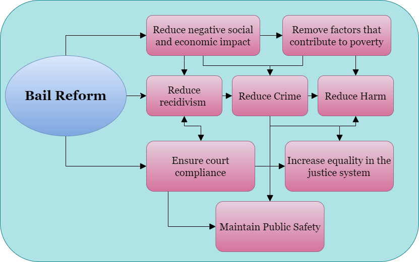
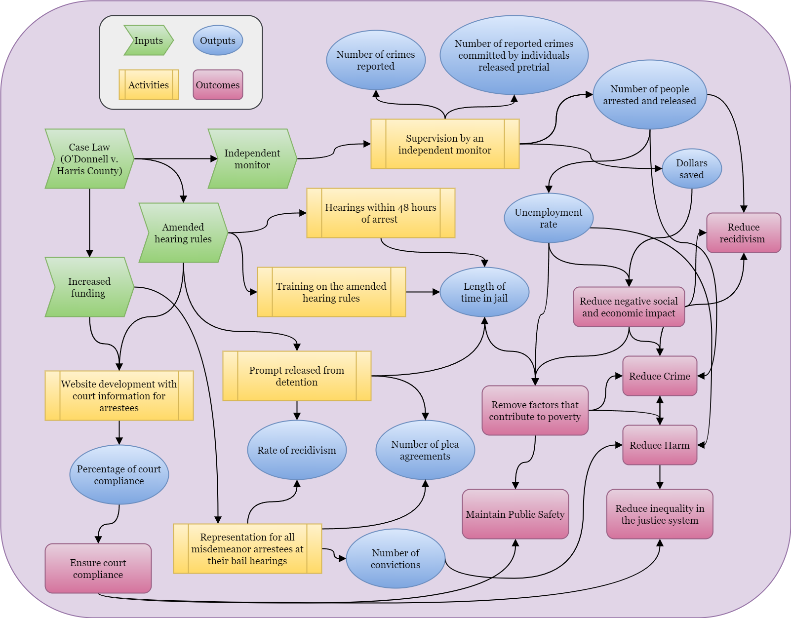

\newpage

```{css, echo=FALSE}

.caption {
  text-align: center;
  font-weight: bold;
  font-size: 100%;
  color: #000;
  margin-top: 10px;
}

```

# 1: Program background and purpose

In May 2016, a young woman filed a class action suit in the U.S. District Court for the Southern District of Texas against Harris County, Texas, and the Harris County Sheriff's Department claiming that the county’s bail system violated the Equal Protection and Due Process Clauses of the Constitution. Bail amounts were set according to a predetermined schedule that did not take individual circumstances into consideration. 

After more than three years in the courts, in November 2019, Judge Rosenthal approved the consent decree which required Harris County to make major reforms to its bail program. Reforms included amended hearing rules and a requirement for clear and convincing evidence that an individual can pay the bail amount required for release. The decree also provided more funding for representation for all misdemeanor bail hearings and a website for arrestees to access important case information to support compliance [@DONNELLHARRISCOUNTY2019].

Money bail systems have long been utilized by the criminal justice system to detain individuals arrested for a crime while they await trial. In a study published in the Stanford Law Review, researchers found that pretrial detention leads to individuals pleading guilty simply to be released, receiving longer jail sentences, and increases the likelihood of the individual committing future crimes [@heatonDownstreamConsequencesMisdemeanor2016]. 

Bail reform, including the elimination of money bail for most misdemeanor offenses, reduces socioeconomic inequality in the justice system, increases compliance with future court dates, and does not contribute to increases in crime in the area [@widraHowDoesUnaffordable2018]. This policy certainly decreases the length of time individuals are detained, and the negative impacts of detention have been well documented. Aside from less quantifiable consequences such as job and income loss while detained, time away from children and family, and the impact and trauma of those relying on the individual for financial and emotional support, there is plenty of empirical support linking pretrial detention to higher rates of conviction [@digardJusticeDeniedHarmful2019]. Reducing the amount of time individuals spend in jail before they are ever convicted of a crime is essential to increasing equality, reducing factors that contribute to criminal activity, and overall reducing harm to a community.
\newpage

# 2: Program theory

The Fourteenth Amendment of the US Constitution protects liberty and equality stating, “No State shall make or enforce any law which shall abridge the privileges or immunities of citizens of the United States; nor shall any State deprive any person of life, liberty, or property, without due process of law; nor deny to any person within its jurisdiction the equal protection of the laws.” Cash bail systems violate this right by imprisoning individuals who have not been convicted of a crime simply for their inability to pay bail. 

If the ultimate goal is to increase equality in the justice system while maintaining public safety, cash bail is impeding that goal. Detaining individuals because they are poor has a negative social and economic impact because it removes people from their families and their jobs. By reducing negative social and economic impacts, factors that contribute to poverty can be lessened or eliminated. A wealth of research exists to support the theory that poverty and inequality are positively correlated with increased crime [@fajnzylberInequalityViolentCrime2002;@freemanEconomicsCrime1999; @fleisherEffectIncomeDelinquency1966; @mohammedDoesPovertyLead2018]. Thus, it follows that removing cash bail for misdemeanors would lead to more equality, which may lead to reduced crime and reduced harm while maintaining public safety.

Detaining individuals without due process is not only unconstitutional and potentially a human rights violation, it also has negative impacts on the community. According to a 2018 study, more than half of inmates in local jails were parents to children under 18, and that percentage was even higher for women [@sawyerWhatDoesSuccessful2022]. In a survey conducted by George Mason University in 2016, 40.5% of detained parents reported that being in jail has or would change the living situation for their children [@kimbrellMoneyBondProcess2016]. The impact on children when the parent they rely on for emotional and financial support is separated from them can be traumatic, significant, and permanent. The same survey also revealed that of the participants, 69.9% were employed before being detained, and of those 84.3% worried they would lose employment due to detention [@kimbrellMoneyBondProcess2016].

Based on the theory that cash bail systems discriminate based on financial status and detention has a negative impact on communities, reforming the bail system is an optimal solution to reduce inequality, crime, and harm in general.



\newpage

# 3: Logic model

## Inputs

- Case Law (O'Donnell v. Harris County)
- Amended hearing rules
- Increased funding 
- Independent monitor

## Activities

- Website development with court information for arrestees
- Training on the amended hearing rules
- Representation for all misdemeanor arrestees at their bail hearings
- Supervision by an independent monitor
- Hearings within 48 hours of arrest 	
- Prompt released from detention

## Outputs

- Number of plea agreements
- Percentage of court compliance
- Rate of recidivism
- Number of people arrested and released
- Number of crimes reported
- Number of reported crimes committed by individuals released pretrial
- Unemployment rate
- Length of time in jail
- Dollars saved
- Number of convictions


## Outcomes

- Removed and reduced factors that contribute to poverty
- Reduced crime
- Reduced harm
- Reduced economic impact
- Increased equality in the justice system
- Maintain public safety


## Diagram


\newpage

# 4: Analysis

Bail reform in Harris County, TX, was implemented by the ruling on *O'Donnell v. Harris County* in 2019, the consent degree explicitly details specific requirements for the county to implement and orders an independent supervisor to ensure compliance and monitor outputs. Because of the thorough discussion and consideration by the court and attorneys, many of the inputs and activities are outlined in the court documents. While discrimination based on financial status and inequality in general stand in opposition to the Constitution, there are measurable outputs that can indicate the success of the reform and its long-lasting impacts to the target communities. Everyone deserves liberty and the right to due process under the law; detaining people before trial for the sole reason that they cannot pay undermines these rights and has negative impacts on individuals who already belong to a marginalized socioeconomic community. 
\newpage

# 5: References


