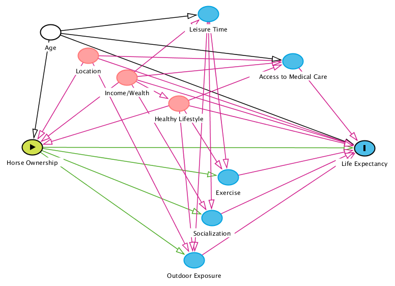
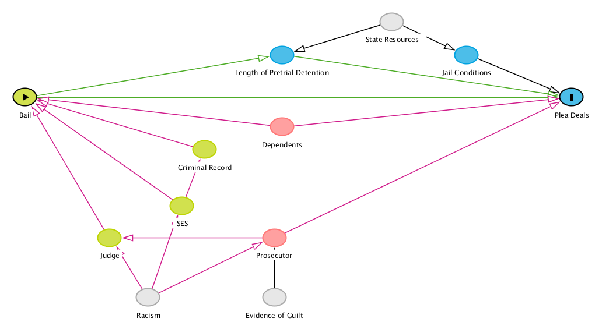

```{css, echo=FALSE}

.caption {
  text-align: center;
  font-weight: bold;
  font-size: 100%;
  color: #000;
  margin-top: 10px;
}

```
```{r setup, warning=FALSE, message=FALSE, echo=FALSE}
library(tidyverse)
library(ggdag)
library(knitr)
```

\newpage

## 1: DAG I: Horse Ownership and Life Expectancy

<center>



</center>

In this article, the authors claim that horse ownership leads to an increased life expectancy. However, the study only observed women from three different areas. The only factor they controlled for was age, and they found the most significant correlation for older participants [@lindabStudiesShowThat2017]. This study does not consider any of the many other factors that contribute to life expectancy, such as income or wealth, location, lifestyle, access to medical care, and leisure time. Wealth and age correlate with leisure time and access to medical care, but also influence life expectancy directly. The authors do explain that horse ownership can contribute to an increase in exercise, socialization, and outdoor exposure, which are all factors associated with a higher life expectancy. However, location, wealth, and lifestyle, can also influence exercise, socialization, and outdoor exposure independently of horse ownership.

The backdoor paths in this causal model are through age, location, income and wealth, and lifestyle. Each of these variables needs to be controlled for. There are no frontdoor paths because each of the factors that horse ownership influences are also influenced by other factors. The study only controlled for age, but income and wealth is arguably a much more confounding factor.

\newpage

## 2: DAG II: Police Reform and Recidivism

```{r example-dag-code, fig.align='center'}
my_dag <- dagify(Recidivism ~ LEAD + CriminalRecord + ServicesResources,
                 LEAD ~ CriminalRecord + Location + SES + Time,
                 CriminalRecord ~ SES + Previous,
                 Previous ~ SES,
                 ServicesResources ~ LEAD + Previous,
                 labels = c("Recidivism" = "Recidivism Rate",
                            "Previous" = "Previous Services and Resources",
                            "CriminalRecord" = "Criminal Record",
                            "ServicesResources" = "Services and Resources",
                            "Location" = "Location",
                            "SES" = "SES",
                            "Time" = "Time",
                            "LEAD" = "LEAD"),
                 exposure = "LEAD",
                 outcome = "Recidivism",
                 coords = list(x = c(Recidivism = 5, 
                                     LEAD = 1, 
                                     Previous = 2.25, 
                                     CriminalRecord = 3, 
                                     ServicesResources = 3.75, 
                                     Location = 1.5, 
                                     SES = 1.75, 
                                     Time = .75),
                               y = c(Recidivism = -2, 
                                     LEAD = -2, 
                                     Previous = -2.5, 
                                     CriminalRecord = -1.75, 
                                     ServicesResources = -2.25, 
                                     Location = -2.75, 
                                     SES = -1.5, 
                                     Time = -2.75))
                 )

my_dag %>% 
  tidy_dagitty() %>%
  ggdag_adjustment_set(text = FALSE, 
                     use_labels = "label", 
                     shadow = TRUE, 
                     text_col = "black",
                     text_size = 2,
                     node_size = 12,
                     expand_x = expansion(c(0.075, 0.075)),
                     expand_y = expansion(c(0.1, 0.1))) + 
    theme_dag() +
    theme(legend.position = "top")

```

While the previous article was obviously a puff piece and I chose it because of how ridiculous their claim was, this article is a scholarly impact evaluation from the *Harvard Law & Policy Review* about harm reduction policing in Seattle, WA. The program evaluated was Seattle’s Law Enforcement Assisted Diversion (LEAD), which began in October 2011. They evaluated the success of the program in terms of recidivism rates. According to their results, LEAD was significantly effective in reducing recidivism [@beckettUsesAbusesPolice2016]. They controlled for criminal record among the participants. The only other influences on whether individuals were selected to participate in LEAD were the time and location of their arrest. In the DAG, I also included socioeconomic status (SES), but since SES influences criminal record and participation in LEAD, its path is blocked off by adjusting for criminal record. However, I also added a node for previous use of services and resources to account for their impact on both criminal record and the effectiveness of the services and resources provided by LEAD. SES also influences previous use of services and resources, reopening the path to recidivism. The last node is resources and services provided through the LEAD referrals and impact recidivism. 

The first and unavoidable backdoor path on the DAG is criminal record, which impacts participation in the program and the likelihood to reoffend. However, the researchers controlled for this in their analysis. Most other factors that might impact recidivism and participation are likely to also impact criminality and criminal record and would therefore be blocked by that control. Either previous use of services and resources or SES must be adjusted for in order to close all backdoors to recidivism rate. By controlling for one or the other, the pathway to the outcome is blocked off. Additionally, unless there is something I am missing that impacts services and resources other than the program itself that cannot be controlled for, there may be a frontdoor path through those outputs that lead to reduced recidivism.

\newpage

## 3: DAG for Bail Affordability and Plea Deals

<center>



</center>

My claim is that bail reform, or elimination of cash bail for misdemeanors, would reduce the number of plea deals that defendants agree to take. The cash bail system requires arrestees to pay a court ordered amount of money in order to be released from jail while awaiting trial. However, many individuals who cannot afford to pay must remain in custody until trial. There is logical and empirical evidence that individuals who can not afford to pay bail agree to plea deals regardless of guilt simply to be released from detention [@subramanianShadowsReviewResearch2020]. Detaining individuals simply on the basis of their inability to pay before they are ever convicted of a crime leads innocent people to accept guilty pleas to avoid additional time away from their families and livelihoods. Based on this logic, it seems plausible that eliminating cash bail would cause less people to choose to accept a guilty plea since they can go about their lives while they await the opportunity to prove their innocence. 

There are many factors that influence both bail, of the affordability of bail, and plea deals, or both. Criminal record and the particular presiding judge may influence whether or how high bail is set; socioeconomic status (SES) also influences whether the amount is affordable or even the amount itself. The prosecutor may influence the judge, and white supremacy and racism may influence both the judge and the prosecutor. Independently, the evidence of guilt, or lack thereof, may impact the prosecutor’s decision on both the request for bail or a plea deal. The affordability of bail directly impacts the length of time someone is detained, but the length of detention for an individual awaiting trial is also determined by state resources to manage criminal cases. State resources also influence jail conditions, and both jail conditions and the length of detention can impact someone’s decision to accept a plea deal to expedite their release. The last factor included is dependents, and this is used as a catch-all variable for dependent family members, job responsibilities and status, and anything or anyone else who might be depending on the arrestee. Dependents can influence the affordability of bail and the acceptance of plea deal to reduce the amount of time away from dependents. 

Though both racism and evidence of guilt are not directly measurable, their paths can be blocked off by adjusting for prosecutor or judge and SES. By controlling for either prosecutor or judge and SES, the backdoor linking bail and plea deals is closed. State resources is another unobservable, or difficult to measure, variable, but it only impacts detention length and conditions which do not impact the affordability of bail. Dependents directly impact the affordability of bail and the attractiveness of a plea deal to secure release from detention and must be controlled for to see the total impact of bail affordability and the number of plea deals accepted. 

\newpage

