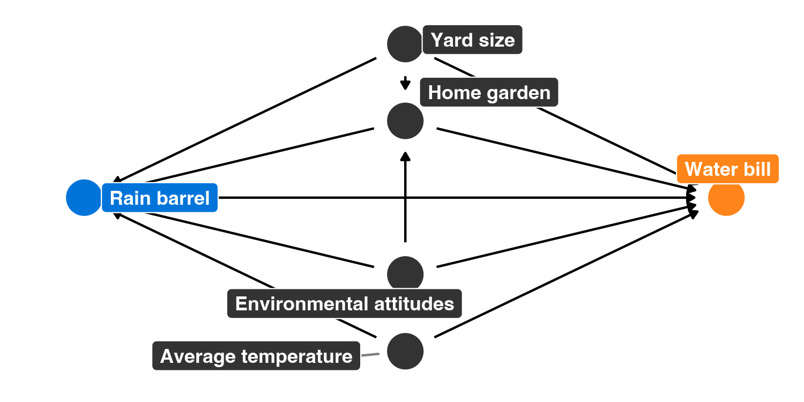

\newpage

# Program overview

The metropolitan Atlanta area is interested in helping residents become more environmentally conscious, reduce their water consumption, and save money on their monthly water bills. To do this, Fulton, DeKalb, Gwinnett, Cobb, and Clayton counties have jointly initiated a new program that provides free rain barrels to families who request them. These barrels collect rain water, and the reclaimed water can be used for non-potable purposes (like watering lawns and gardens). Officials hope that families that use the barrels will rely more on rain water and will subsequently use fewer county water resources, thus saving both the families and the counties money.

Being evaluation-minded, the counties hired an evaluator (you!) before rolling out their program. You convinced them to fund and run a randomized controlled trial (RCT) during 2018, and the counties rolled out the program city-wide in 2019. You have two datasets: `barrels_rct.csv` with data from the RCT, and `barrels_obs.csv` with observational data from self-selected participants.

These datasets contain the following variables:

- `id`: A unique ID number for each household
- `water_bill`: The family's average monthly water bill, in dollars
- `barrel`: An indicator variable showing if the family participated in the program
- `barrel_num`: A 0/1 numeric version of `barrel`
- `yard_size`: The size of the family's yard, in square feet
- `home_garden`: An indicator variable showing if the family has a home garden
- `home_garden_num`: A 0/1 numeric version of `home_garden`
- `attitude_env`: The family's self-reported attitude toward the environment, on a scale of 1-10 (10 meaning highest regard for the environment)
- `temperature`: The average outside temperature (these get wildly unrealistic for the Atlanta area; just go with it)


# Your goal

Your task in this problem set is to analyze these two datasets to find the causal effect (or average treatment effect (ATE)) of this hypothetical program. 

***Follow these two examples from class as guides:***

- [RCTs](https://evalsp22.classes.andrewheiss.com/example/rcts/)
- [Matching and IPW](https://evalsp22.classes.andrewheiss.com/example/matching-ipw/)

As a reference, Figure 1 shows the DAG for the program:



---

\newpage

```{r setup, warning=FALSE, message=FALSE}
library(tidyverse)
library(broom)
library(patchwork)
library(MatchIt)
library(kableExtra)
library(modelsummary)
library(huxtable)

barrels_rct <- read_csv("data/barrels_rct.csv") %>% 
  # This makes it so "No barrel" is the reference category
  mutate(barrel = fct_relevel(barrel, "No barrel"))

barrels_obs <- read_csv("data/barrels_observational.csv") %>% 
  # This makes it so "No barrel" is the reference category
  mutate(barrel = fct_relevel(barrel, "No barrel"))
```

\newpage

# 1. Finding causation from a randomized controlled trial

## Modified DAG

You can draw a DAG without any arrows to the treatment in an RCT because the random selection for the trial essentially controls for all possible confounding variables. Assuming the selection is truly random, there should be no fundamental difference between the treatment and control groups.


\newpage

## Check balance

The sample for the RCT contains 493 observations. 272 were assigned to treatment and the remaining 221 where in the control group. Since the two groups have close to the same amount of observations, they should be comparable for analysis. The probability of being in either group is split 45/55, which is close enough to 50/50.

```{r balance}

barrels_rct %>% 
  count(barrel) %>%
  mutate(prop = n / sum(n))

```

When checking the balance of the pre-treatment characteristics, average yard size, attitudes about the environment, and average temperature are very similar. The only characteristic that had some variation was the presence of a home garden. Those in the control group more likely to have a home garden, but the difference is not statistically significant. 

```{r characteristics}

barrels_rct %>% 
  group_by(barrel) %>% 
  summarise(avg_yard = mean(yard_size),
            prop_garden = mean(home_garden_num),
            avg_attitude = mean(attitude_env),
            avg_temp = mean(temperature))

```
```{r plot_yard, fig.align='center', fig.cap="Balance of Pre-treatment Yard Size"}

plot_diff_yard <- ggplot(barrels_rct, aes(x = barrel, y = yard_size, color = barrel)) +
  stat_summary(geom = "pointrange", fun.data = "mean_se", fun.args = list(mult = 1.96)) +
  guides(color = "none") +
  labs(x = NULL, y = "Proportion with Home Garden")

plot_hist_yard <- ggplot(barrels_rct, aes(x = yard_size, fill = barrel)) +
  geom_histogram(binwidth = 1000, color = "white") +
  guides(fill = "none") +
  labs(x = "Yard Size", y = "Count") +
  facet_wrap(vars(barrel), ncol = 1)

plot_diff_yard + plot_hist_yard

```
```{r plot_garden, fig.align='center', fig.cap="Balance of Pre-treatment Home Garden"}

plot_diff_barrels_rct <- ggplot(barrels_rct, aes(x = barrel, y = home_garden_num, color = barrel)) +
  stat_summary(geom = "pointrange", fun.data = "mean_se", fun.args = list(mult = 1.96)) +
  guides(color = "none") +
  labs(x = NULL, y = "Proportion with Home Garden")

plot_prop_barrels_rct <- ggplot(barrels_rct, aes(x = barrel, fill = home_garden)) +
  geom_bar(position = "fill") +
  labs(x = NULL, y = "Proportion", fill = NULL) +
  scale_fill_manual(values = c("darkblue", "darkred")) +
  theme(legend.position = "bottom")
  

plot_diff_barrels_rct + plot_prop_barrels_rct

```
```{r plot_attitude, fig.align='center', fig.cap="Balance of Pre-treatment Attitude about the Environment"}

plot_diff_attitude <- ggplot(barrels_rct, aes(x = barrel, y = attitude_env, color = barrel)) +
  stat_summary(geom = "pointrange", fun.data = "mean_se", fun.args = list(mult = 1.96)) +
  guides(color = "none") +
  labs(x = NULL, y = "Proportion with Home Garden")

plot_hist_attitude <- ggplot(barrels_rct, aes(x = attitude_env, fill = barrel)) +
  geom_histogram(binwidth = 1, color = "white") +
  guides(fill = "none") +
  labs(x = "Yard Size", y = "Count") +
  facet_wrap(vars(barrel), ncol = 1)

plot_diff_attitude + plot_hist_attitude

```
```{r plot_temp, fig.align='center', fig.cap="Balance of Pre-treatment Temperature"}

plot_diff_temp <- ggplot(barrels_rct, aes(x = barrel, y = temperature, color = barrel)) +
  stat_summary(geom = "pointrange", fun.data = "mean_se", fun.args = list(mult = 1.96)) +
  guides(color = "none") +
  labs(x = NULL, y = "Proportion with Home Garden")

plot_hist_temp <- ggplot(barrels_rct, aes(x = temperature, fill = barrel)) +
  geom_histogram(binwidth = 5, color = "white") +
  guides(fill = "none") +
  labs(x = "Yard Size", y = "Count") +
  facet_wrap(vars(barrel), ncol = 1)

plot_diff_temp + plot_hist_temp

```

\newpage

## Estimate difference

According to the data, the difference in the water bill charges between the treatment and control group is $40.57. This result is statistically significant. However, there may be credibility issues, considering there are other unobserved variables which could influence the price of the water bill, such as number of people in the household.

```{r difference}

barrels_rct %>%
  group_by(barrel) %>%
  summarize(avg_bill = mean(water_bill))

```

```{r model}

model_rct <- lm(water_bill ~ barrel, data = barrels_rct)

modelsummary(model_rct,
             coef_rename = c(barrelBarrel = "Barrel"),
             output = "kableExtra",
             statistic = "conf.int",
             title = "RCT Results") %>% 
    row_spec(c(1,3,5,7,9,11), background = "#f7fabe") 

```

```{r plot, fig.align='center', fig.cap="Barrel Water Bill Difference"}

ggplot(barrels_rct, aes(x = barrel, y = water_bill, color = barrel)) +
  stat_summary(geom = "pointrange", fun.data = "mean_se", fun.args = list(mult = 1.96)) +
  guides(color = "none") +
  labs(x = NULL, y = "Water Bill")

```

\newpage

# 2. Finding causation from observational data

## Naive difference in means

The average difference in water bills for those in the program and those not in the program from the observational data is that those in the program had water bills that were $29.86 lower than those not in the program. This result is not terribly credible because there are several confounding variables which could influence the treatment and the outcome.

```{r count}

barrels_obs %>%
  group_by(barrel) %>%
  summarize(number = n(),
            avg = mean(water_bill))

```

```{r regression}

model_bill <- lm(water_bill ~ barrel, data = barrels_obs)

modelsummary(model_bill,
             coef_rename = c(barrelBarrel = "Barrel"),
             output = "kableExtra",
             statistic = "conf.int",
             title = "Naive difference in means") %>% 
    row_spec(c(1,3,5,7,9,11), background = "#f7fabe") 

```

\newpage

## Adjustment with Mahalanobis nearest-neighbor matching

```{r match}

matched_data <- matchit(barrel_num ~ yard_size + home_garden_num + attitude_env + temperature,
                        data = barrels_obs,
                        method = "nearest",
                        distance = "mahalanobis",
                        replace = TRUE)
summary(matched_data)

matched_data_for_real <- match.data(matched_data)

```

```{r matchedModel}

model_match <- lm(water_bill ~ barrel, 
                  data = matched_data_for_real)

modelsummary(model_match,
             coef_rename = c(barrelBarrel = "Barrel"),
             output = "kableExtra",
             statistic = "conf.int",
             title = "Matched Results") %>% 
    row_spec(c(1,3,5,7,9,11), background = "#f7fabe") 

```

```{r matchWeights}

model_match_wts <- lm(water_bill ~ barrel, 
                      data = matched_data_for_real, 
                      weights = weights)

modelsummary(model_match_wts,
             coef_rename = c(barrelBarrel = "Barrel"),
             output = "kableExtra",
             statistic = "conf.int",
             title = "Matched & Weighted Results") %>% 
    row_spec(c(1,3,5,7,9,11), background = "#f7fabe") 

```

\newpage

## Adjustment with inverse probability weighting

```{r ipw}

model_barrel <- glm(barrel ~ yard_size + home_garden + attitude_env + temperature,
                   data = barrels_obs,
                   family = binomial(link = "logit"))

barrel_probabilities <- augment_columns(model_barrel,
                                     barrels_obs,
                                     type.predict = "response") %>%
  rename(propensity = .fitted)

barrel_probabilities %>%
  select(id, barrel, yard_size, home_garden, attitude_env, temperature, propensity) %>%
  head()

```

```{r ipwProp}

barrel_ipw <- barrel_probabilities %>%
  mutate(ipw = (barrel_num / propensity) + ((1 - barrel_num) / (1 - propensity)))

barrel_ipw %>%
  select(id, barrel, yard_size, home_garden, attitude_env, temperature, propensity, ipw) %>%
  head()

```

```{r estimation}

model_ipw <- lm(water_bill ~ barrel,
                data = barrel_ipw,
                weights = ipw)

modelsummary(model_ipw,
             coef_rename = c(barrelBarrel = "Barrel"),
             output = "kableExtra",
             statistic = "conf.int",
             title = "IPW Results") %>% 
    row_spec(c(1,3,5,7,9,11), background = "#f7fabe") 

```


\newpage

# 3. Comparing results

```{r modelall}

my_gof <- tribble(
  ~raw, ~clean, ~fmt,
  "nobs", "N", 0,
  "adj.r.squared", "R2", 2
  
)


modelsummary(list("RCT" = model_rct,
                  "Naive correlation" = model_bill,
                  "Matched" = model_match,
                  "Matched & Weighted" = model_match_wts,
                  "IPW" = model_ipw),
             coef_rename = c(barrelBarrel = "Barrel"),
             output = "kableExtra",
             statistic = NULL,
             title = "RCT and Observational Results",
             fmt =  2,
             gof_map = my_gof) %>% 
     row_spec(c(1,3), background = "#f7fabe")

```

The matched and weighed estimate and the IPW estimate are the closest to the RCT estimate, and they are all very similar. The consistency across methods indicates a higher degree of accuracy. The observational ATEs are sufficient to prove program effect when they are matched and weighted or the IPW method was used. The naive correlation and simply matched estimates are less credible. The matched and weighed estimate, the IPW estimate, and the RCT estimate are all very close to each other, especially both observational estimates. Since there is not a major difference in these estimates, and different methods produce a similar result, indicating consistency and credibility. This program could be rolled out throughout Georgia, but some characteristics should be considered. Locations with different sized yards, gardens, political views, and temperature may respond differently to the program. There may also be other unobserved characteristics that could impact the effectiveness of the program. 


